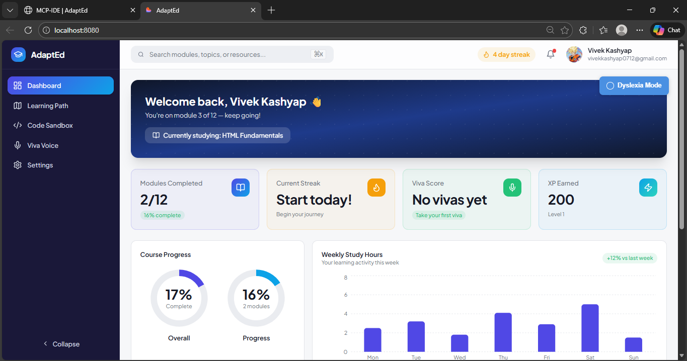
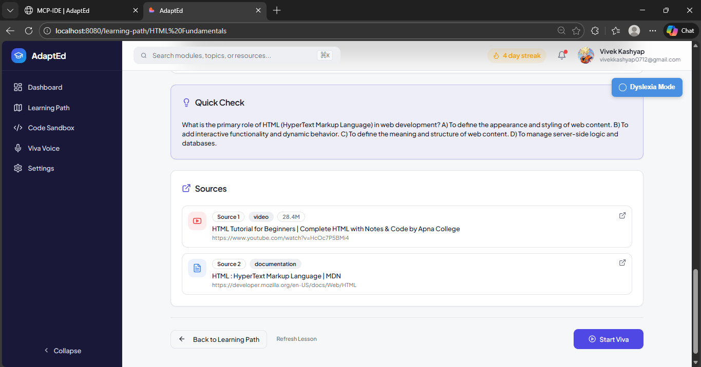
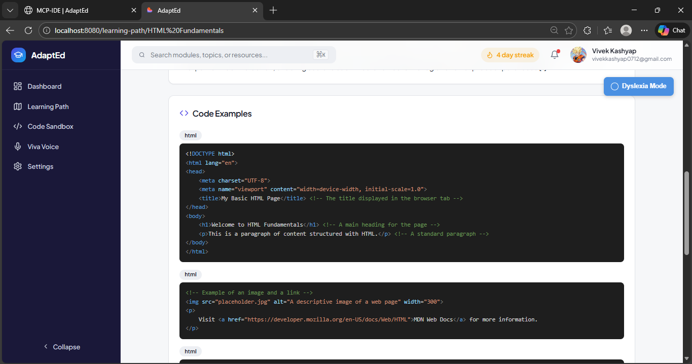
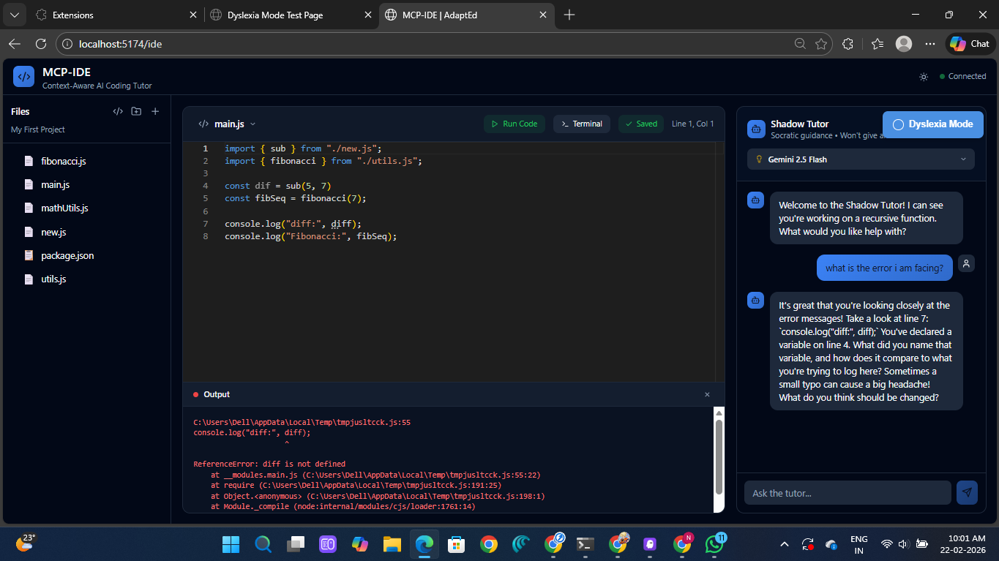
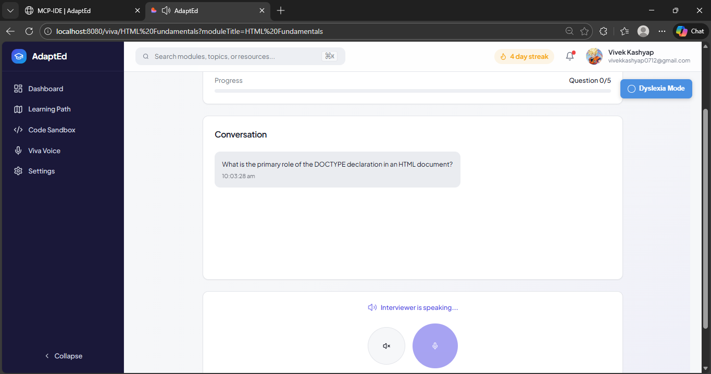
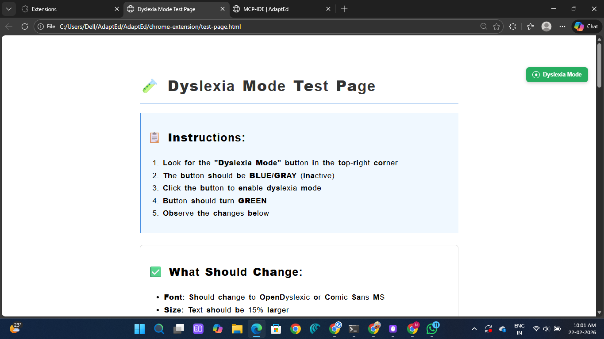

# AdaptEd - Adaptive Learning Platform

<div align="center">
  <h3>🎓 Personalized Learning • 🤖 AI-Powered • 💻 Hands-on Coding</h3>
  <p>An intelligent learning platform that adapts to your pace and learning style</p>
  <p><strong>Built on AWS Cloud Infrastructure</strong> ☁️</p>
</div>

---

## 📸 Screenshots

### Dashboard - Learning Progress Overview

*Track your learning progress, streaks, XP, and upcoming modules*

### AI-Generated Lessons with Multi-Source Citations

*Lessons synthesized from multiple sources with Perplexity-style attribution*

### Comprehensive Study Notes

*AI-generated study notes with key takeaways and practice exercises*

### MCP-IDE - Integrated Development Environment

*Full-featured code editor with AI tutor, multi-file support, and real-time execution*

### Viva Voice - Voice-Based Examinations

*Interactive voice assessments with speech-to-text and AI evaluation*

### Dyslexia-Friendly Mode

*Chrome extension providing accessible reading experience with OpenDyslexic font*

---

## 🌟 Overview

AdaptEd is a comprehensive learning platform built on **AWS cloud infrastructure**, providing:
- **Personalized Learning Roadmaps** - AI-generated paths using AWS Bedrock (Claude 3)
- **Interactive Lessons** - Rich content with videos, documentation, and hands-on exercises
- **Viva Voice Examinations** - Voice-based assessments powered by AWS Transcribe & Polly
- **Code Sandbox (MCP-IDE)** - Full-featured IDE with AI tutor for coding practice
- **Progress Tracking** - Detailed analytics stored in AWS DynamoDB
- **Accessibility Features** - Dyslexia-friendly mode via Chrome extension

### ☁️ AWS-Powered Architecture

AdaptEd leverages multiple AWS services for enterprise-grade scalability and reliability:

- **AWS Bedrock (Claude 3)** - AI content generation and intelligent tutoring
- **AWS DynamoDB** - Serverless NoSQL database for user data and roadmaps
- **AWS Transcribe** - Speech-to-text for voice examinations
- **AWS Polly** - Text-to-speech for AI interviewer responses
- **AWS S3** - Secure file storage for audio and media
- **AWS EC2** - Scalable compute for application hosting

## 📁 Project Structure

```
AdaptEd/
├── frontend/              # Main React frontend (Port 5173)
├── backend/              # Python FastAPI backend (Port 8001)
├── mcp-ide/              # Integrated coding environment
│   ├── frontend/         # IDE React frontend (Port 5174)
│   └── backend/          # IDE Python backend (Port 8000)
├── sample-frontend/      # Demo/template frontend (Port 8080)
├── chrome-extension/     # Dyslexia mode extension
└── docs/                 # Documentation

```

## 🚀 Quick Start

### Prerequisites

- **Node.js** 18+ and npm
- **Python** 3.8+
- **Git**
- **AWS Account** with access to:
  - AWS Bedrock (Claude 3 models)
  - AWS DynamoDB
  - AWS Transcribe
  - AWS Polly
  - AWS S3
- **AWS Credentials** (Access Key ID and Secret Access Key)
- **Firebase Account** (for authentication)

### Installation

#### 1. Clone the Repository
```bash
git clone <repository-url>
cd AdaptEd
```

#### 2. Setup Main Frontend
```bash
cd frontend
npm install
cp .env.example .env
# Edit .env and add your Firebase credentials
npm run dev  # Runs on http://localhost:5173
```

#### 3. Setup Main Backend (AWS-Powered)
```bash
cd backend

# Install Python dependencies
python -m venv venv
venv\Scripts\activate  # Windows
# source venv/bin/activate  # Mac/Linux
pip install -r requirements.txt

# Configure AWS credentials
cp .env.example .env
# Edit .env and add:
# - AWS_ACCESS_KEY_ID
# - AWS_SECRET_ACCESS_KEY
# - AWS_REGION (default: us-east-1)

# Set up AWS infrastructure (DynamoDB tables, S3 bucket)
python aws_setup.py

# Start backend
python -m uvicorn main:app --reload --port 8001
```

**Note**: You need to enable AWS Bedrock and request access to Claude 3 models in the AWS Console before running the backend.

#### 4. Setup MCP-IDE Frontend
```bash
cd mcp-ide/frontend
npm install
npm run dev  # Runs on http://localhost:5174
```

#### 5. Setup MCP-IDE Backend
```bash
cd mcp-ide/backend
python -m venv venv
venv\Scripts\activate  # Windows
pip install -r requirements.txt
cp .env.example .env
# Edit .env and add Supabase credentials
python -m uvicorn app.main:app --reload --port 8000
```

#### 6. Setup Chrome Extension (Optional)
```bash
# Load unpacked extension in Chrome
# 1. Go to chrome://extensions/
# 2. Enable "Developer mode"
# 3. Click "Load unpacked"
# 4. Select AdaptEd/chrome-extension folder
```

## 🎯 Features

### 1. Personalized Learning Roadmaps (AWS Bedrock)
- AI-generated learning paths using Claude 3 via AWS Bedrock
- Adaptive content that skips what you already know
- Weekly module structure with clear progression
- Support for multiple tech stacks (Full-Stack, Frontend, Backend, DevOps, etc.)

### 2. Interactive Lessons (AWS Bedrock + Multi-Source)
- Rich content with multiple sources:
  - YouTube video tutorials
  - MDN documentation
  - Interactive examples
- AI-generated lesson content using AWS Bedrock (Claude 3)
- Progress tracking per module
- Note-taking and bookmarking

### 3. Viva Voice Examinations (AWS Transcribe + Polly)
- Voice-based Q&A assessments powered by AWS services
- 5 questions per module
- Pass threshold: 60%
- Speech recognition using AWS Transcribe
- AI-powered evaluation using AWS Bedrock (Claude 3)
- Natural voice responses using AWS Polly

### 4. Code Sandbox (MCP-IDE)
- Full-featured code editor with Monaco
- Multi-file support with file explorer
- AI coding tutor (Shadow Tutor)
- Code execution for JavaScript, Python, C++
- Terminal integration
- Code history and snapshots
- RAG-powered context-aware assistance
- Embedded in main app or standalone

### 5. Progress Dashboard (AWS DynamoDB)
- Module completion tracking stored in DynamoDB
- Streak counter
- XP and leveling system
- Viva score analytics
- Weekly activity charts
- Achievement badges

### 6. Accessibility
- Dyslexia-friendly mode
- Chrome extension for web-wide support
- Customizable fonts and spacing
- High contrast options

## 🔧 Configuration

### Environment Variables

#### Main Frontend (.env)
```env
VITE_FIREBASE_API_KEY=your_firebase_api_key
VITE_FIREBASE_AUTH_DOMAIN=your_project.firebaseapp.com
VITE_FIREBASE_PROJECT_ID=your_project_id
VITE_FIREBASE_STORAGE_BUCKET=your_project.appspot.com
VITE_FIREBASE_MESSAGING_SENDER_ID=your_sender_id
VITE_FIREBASE_APP_ID=your_app_id
VITE_API_URL=http://localhost:8001
```

#### Main Backend (.env)
```env
# AWS Credentials (Required)
AWS_ACCESS_KEY_ID=your_aws_access_key_id
AWS_SECRET_ACCESS_KEY=your_aws_secret_access_key
AWS_REGION=us-east-1

# AWS DynamoDB Tables
DYNAMODB_USERS_TABLE=adapted-users
DYNAMODB_ROADMAPS_TABLE=adapted-roadmaps
DYNAMODB_VIVA_SESSIONS_TABLE=adapted-viva-sessions

# AWS S3 Bucket
S3_AUDIO_BUCKET=adapted-audio-files

# YouTube API (Optional)
YOUTUBE_API_KEY=your_youtube_api_key
```

#### MCP-IDE Backend (.env)
```env
SUPABASE_URL=your_supabase_url
SUPABASE_KEY=your_supabase_anon_key
# Note: MCP-IDE can be migrated to AWS RDS if needed
```

### Port Configuration

| Service | Port | URL |
|---------|------|-----|
| Main Frontend | 5173 | http://localhost:5173 |
| Main Backend | 8001 | http://localhost:8001 |
| MCP-IDE Frontend | 5174 | http://localhost:5174 |
| MCP-IDE Backend | 8000 | http://localhost:8000 |
| Sample Frontend | 8080 | http://localhost:8080 |

## 📚 API Documentation

### Main Backend Endpoints

#### Roadmap Generation
```
POST /generate-roadmap
Body: { goal, current_skills, time_commitment }
```

#### Lesson Content
```
POST /generate-lesson-content
Body: { topic, module_title, week }
```

#### Viva Examinations
```
POST /viva/start-simple?module_topic=...&user_goal=...
POST /viva/chat
Body: { session_id, user_text, module_topic }
POST /viva/complete
Body: { user_id, module_id, final_score }
```

### MCP-IDE Backend Endpoints

#### File Management
```
GET /api/v1/files/projects
POST /api/v1/files/files
GET /api/v1/files/files/{file_id}
PATCH /api/v1/files/files/{file_id}
```

#### Code Execution
```
POST /api/v1/executor/run
Body: { code, language, project_id, file_path }
```

#### AI Tutor
```
POST /api/v1/tutor/ask
Body: { editor_state, user_question, model_type }
```

## 🎨 Tech Stack

### Frontend
- **React** 18 with TypeScript
- **Vite** for build tooling
- **TailwindCSS** for styling
- **Framer Motion** for animations
- **Monaco Editor** for code editing
- **React Query** for data fetching
- **React Router** for navigation
- **Firebase** for authentication

### Backend
- **FastAPI** (Python)
- **AWS Bedrock** (Claude 3) for AI generation
- **AWS DynamoDB** for NoSQL database
- **AWS Transcribe** for speech-to-text
- **AWS Polly** for text-to-speech
- **AWS S3** for file storage
- **YouTube API** for video search

### Infrastructure
- **AWS EC2** for application hosting
- **AWS CloudWatch** for monitoring and logging
- **AWS IAM** for access management
- **Boto3** (AWS SDK for Python)

### AI/ML
- **AWS Bedrock (Claude 3 Sonnet)** - Content generation and conversation
- **AWS Transcribe** - Speech recognition
- **AWS Polly (Neural)** - Natural voice synthesis
- **Sentence Transformers** - Code embeddings (MCP-IDE)
- **RAG** - Context-aware tutoring

## 🧪 Testing

### Frontend
```bash
cd frontend
npm run test
npm run test:coverage
```

### Backend
```bash
cd backend
pytest
pytest --cov
```

### MCP-IDE
```bash
cd mcp-ide/backend
pytest tests/
```

## 📖 User Guide

### Getting Started

1. **Sign Up/Login** - Use Google authentication
2. **Onboarding** - Set your learning goal and current skills
3. **Roadmap Generation** - AI creates your personalized path
4. **Start Learning** - Follow modules week by week
5. **Take Vivas** - Pass voice exams to unlock next modules
6. **Practice Coding** - Use Code Sandbox for hands-on practice

### Taking a Viva

1. Navigate to "Viva Voice" in sidebar
2. Select a module you've completed
3. Click "Start Viva"
4. Answer 5 questions using voice or text
5. Get instant feedback and scoring
6. Pass with 60% or higher

### Using Code Sandbox

1. Click "Code Sandbox" in sidebar
2. MCP-IDE loads in embedded view
3. Create files, write code, run programs
4. Ask AI tutor for help
5. Click maximize for fullscreen mode

## 🔒 Security

- Firebase Authentication for user management
- API key validation on all endpoints
- CORS configuration for cross-origin requests
- Environment variables for sensitive data
- No PII stored in code or logs

## 🐛 Troubleshooting

### Frontend won't start
```bash
# Clear node_modules and reinstall
rm -rf node_modules package-lock.json
npm install
```

### Backend API errors
```bash
# Check if AWS credentials are set
cat backend/.env
# Verify AWS Bedrock access
aws bedrock list-foundation-models --region us-east-1
# Restart backend
python -m uvicorn main:app --reload --port 8001
```

### AWS Bedrock Access Denied
- Go to AWS Console → Bedrock → Model access
- Request access to Claude 3 models
- Wait for approval (usually instant)
- Verify IAM permissions include `bedrock:InvokeModel`

### DynamoDB Table Not Found
```bash
# Run AWS setup script to create tables
cd backend
python aws_setup.py
```

### AWS Transcribe Errors
- Verify audio file format (WAV, MP3, FLAC supported)
- Check S3 bucket exists and has correct permissions
- Ensure IAM role has `transcribe:StartTranscriptionJob` permission

### MCP-IDE not loading
- Verify MCP-IDE frontend is running on port 5174
- Check browser console for CORS errors
- Ensure Supabase credentials are correct (or migrate to AWS RDS)

### Viva not working
- Check if main backend is running on port 8001
- Verify AWS Transcribe and Polly are enabled in your region
- Test with text input first (fallback mode)

## 📝 Development

### Adding a New Feature

1. Create a branch: `git checkout -b feature/your-feature`
2. Make changes
3. Test thoroughly (including AWS integration)
4. Commit: `git commit -m "Add: your feature"`
5. Push: `git push origin feature/your-feature`
6. Create Pull Request

### Code Style

- **Frontend**: ESLint + Prettier
- **Backend**: Black + Flake8
- **Commits**: Conventional Commits format

### AWS Best Practices

1. **Use IAM roles** instead of hardcoded credentials in production
2. **Enable CloudWatch logging** for all services
3. **Set up billing alerts** to avoid unexpected costs
4. **Use AWS Secrets Manager** for sensitive data
5. **Enable DynamoDB point-in-time recovery** for data protection

## ☁️ AWS Deployment

For detailed AWS deployment instructions, see [AWS_DEPLOYMENT.md](AWS_DEPLOYMENT.md)

### Quick Deploy to AWS EC2

```bash
# 1. Launch EC2 instance (t3.medium recommended)
aws ec2 run-instances \
  --image-id ami-0c55b159cbfafe1f0 \
  --instance-type t3.medium \
  --key-name your-key-pair

# 2. SSH into instance
ssh -i your-key.pem ec2-user@your-instance-ip

# 3. Clone and setup
git clone https://github.com/your-repo/AdaptEd.git
cd AdaptEd/backend
pip3 install -r requirements.txt
python3 aws_setup.py

# 4. Run application
python3 -m uvicorn main:app --host 0.0.0.0 --port 8001
```

### AWS Cost Estimation

For 100 active users per month:
- **AWS Bedrock**: ~$30
- **DynamoDB**: ~$1.25
- **Transcribe**: ~$12
- **Polly**: ~$8
- **S3**: ~$0.30
- **EC2 (2x t3.medium)**: ~$60
- **Total**: ~$116/month

See [AWS_DEPLOYMENT.md](AWS_DEPLOYMENT.md) for detailed cost breakdown and optimization tips.

## 🤝 Contributing

Contributions are welcome! Please:
1. Fork the repository
2. Create a feature branch
3. Make your changes
4. Add tests
5. Submit a pull request

## 📄 License

[Your License Here]

## 👥 Team

[Your Team Information]

## 🙏 Acknowledgments

- **AWS** for cloud infrastructure and AI services (Bedrock, DynamoDB, Transcribe, Polly)
- **Anthropic** for Claude 3 AI models via AWS Bedrock
- **Firebase** for authentication
- **Monaco Editor** for code editing
- All open-source contributors

## 📞 Support

- **Issues**: [GitHub Issues]
- **Email**: [support@adapted.com]
- **Docs**: [Documentation Site]
- **AWS Support**: For AWS-specific issues, contact AWS Support

## 🗺️ Roadmap

### Current Version (v1.0)
- ✅ Personalized roadmaps (AWS Bedrock)
- ✅ Interactive lessons (AWS Bedrock)
- ✅ Viva examinations (AWS Transcribe + Polly)
- ✅ Code sandbox
- ✅ Progress tracking (AWS DynamoDB)
- ✅ AWS cloud deployment

### Upcoming Features
- 🔄 Mobile app
- 🔄 Collaborative coding
- 🔄 Live mentorship
- 🔄 Certificate generation
- 🔄 Community forums
- 🔄 AWS Lambda serverless functions
- 🔄 AWS CloudFront CDN integration

## 📊 Project Stats

- **Lines of Code**: ~50,000+
- **Components**: 100+
- **API Endpoints**: 30+
- **Supported Languages**: JavaScript, Python, C++
- **AI Models**: AWS Bedrock (Claude 3)
- **Cloud Provider**: AWS
- **Database**: AWS DynamoDB
- **Speech Services**: AWS Transcribe + Polly

---

Made with ❤️ by the AdaptEd Team | **Powered by AWS** ☁️ | **Built with Claude 3** 🤖
